# Platform: Android

[](https://github.com/rust-multiplatform/Base-Project-Template/actions/workflows/platform_android.yml)
[](https://codecov.io/gh/rust-multiplatform/Base-Project-Template)

This is the platform-specific project for the platform Android.  
Make sure to check the shared crate as we depend on it.

## How does this work?

Rust is a cross-platform language that supports many different architectures and platforms.  
Building for Desktop Platforms (like Windows, Linux, macOS) is natively supported as long as the required tools are installed.
For Android, iOS and WebAssembly (WASM) we _"require"_ some additional tools to build.
In essence, we could do it without those tools but it would be much harder to do so.
Said tools commonly package our apps into .APK, .APP and .JS/WASM, link them against our library and make sure the entrypoint is called.

Inside `src/lib.rs` we have a public entrypoint defined:

```rust
pub fn entrypoint() {
    // Our cross-platform code here
}
```

Each platform calls this, while each platform itself has an entrypoint.  

Ideally, we **only** have our shared code.  
However, sometimes we need some very platform specific things that can only be done on said platform.
In this case we have _some_ non-shared/platform-specific code but overall this should only be true for very special cases as the Rust standard library works mostly the same on each platform/target.

## What does this crate do?

For Android we can't use the standard Rust-Entrypoint (`src/main.rs ::  fn main() { ... }`), but have to define a library (`src/lib.rs`) and have it have a `pub fn main()` function:

```rust
#[cfg_attr(target_os = "android", ndk_glue::main(backtrace = "on"))]
pub fn main() {
    // OUR CODE HERE
}

```

> Note that Rust will warn you that `lib.rs::main` is unused.  
> Thus, we may use `#[allow(dead_code)]` to allow this to happen.  
> We are building a **native library** that will be linked together with the Android NDK. Rust can't see that part.  
> In some sense we are doing the same thing here as we are doing with the shared library entrypoint.

Within the main function we call our entrypoint of the shared library.
Check out the shared crate for more on how this is working and what it is doing.

This is the most basic of examples: A simple `"Hello World"` or better yet: `"Hello from Rust!"` to the standard output.  
On Desktop platforms this will open a Terminal/Console printing out the text and exiting.  
For Android, iOS and WebAssembly this will be logged to LogCat, Device Logs and the Browser Console respectively.  

**Independent of the platform the app will _exit_ right after being done. Depending on the platform the window (console _or_ app) may close before you even see it.**  
On Desktop you can call the executable from a terminal either by using the executable in `target/(debug|release|<arch>)/platform_*(.exe)` or using the `cargo run --package platform_<platform>` command.
For Android, iOS and WebAssembly enable persistent logging and reopen the app/website.

## Android Setup

The following is split into two parts depending on which path you take:  

1. [Android Studio](https://developer.android.com/studio/)
2. [Android CommandLine-Tools](https://developer.android.com/studio/#command-tools)
3. Both

Skip whatever path you aren't using.

### Android Studio

First, download and install Android Studio from [here](https://developer.android.com/studio/).  
Make sure it's the correct installer for your host OS.

Upon opening Android Studio for the first time you will be greeted with a setup screen and an import settings screen:

> Please note that on later version of Android Studio and different OS's this _may_ look different.  
> Feel free to open an issue if it looks different for you.


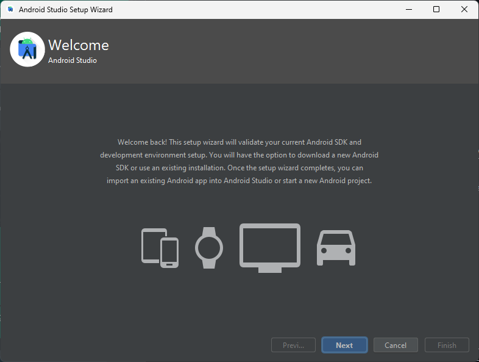

Do not import any settings and click next on the welcome screen.

Next, select the standard profile:  

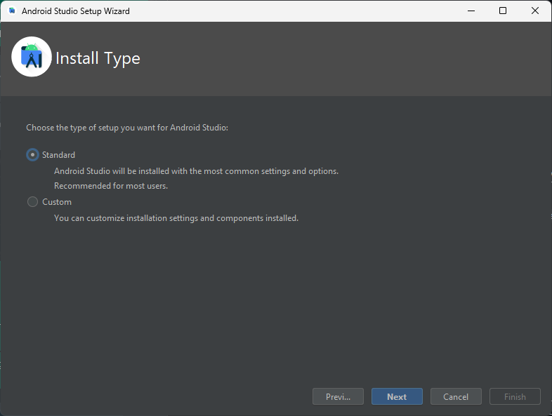

We are going to change the installed SDKs soon anyways.

Finally, select a theme and finish the setup:  

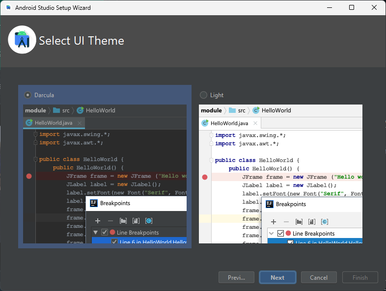

You may get prompted to download components or accept licenses, do this.

Next, you should see the main screen of Android Studio:

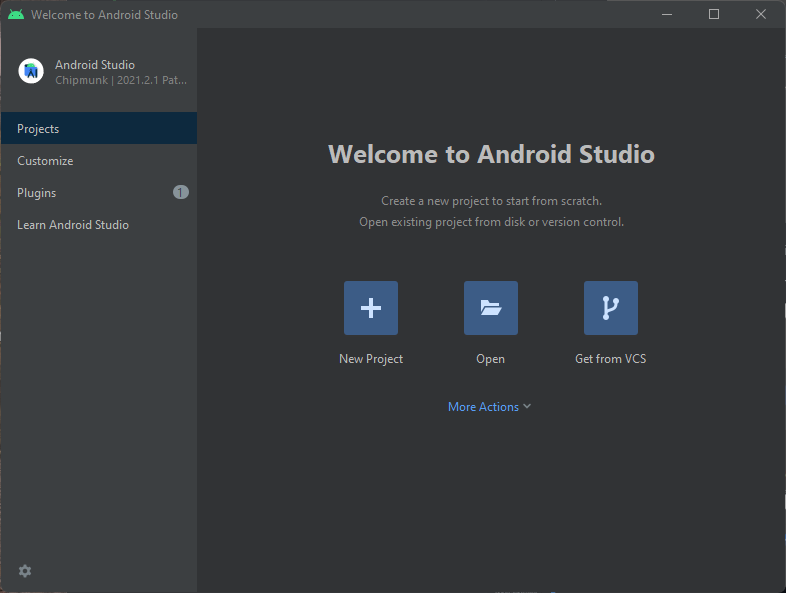

Go to **Customize** and select **All settings...**:

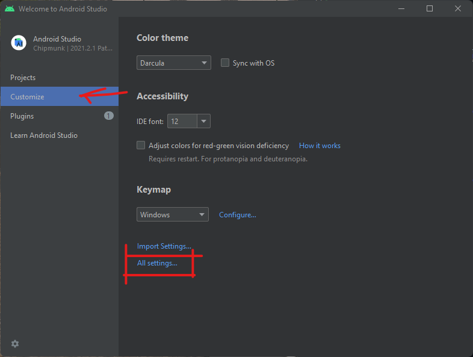

In here, select **Android SDK** under **Appearance & Behavior -> System Settings**:

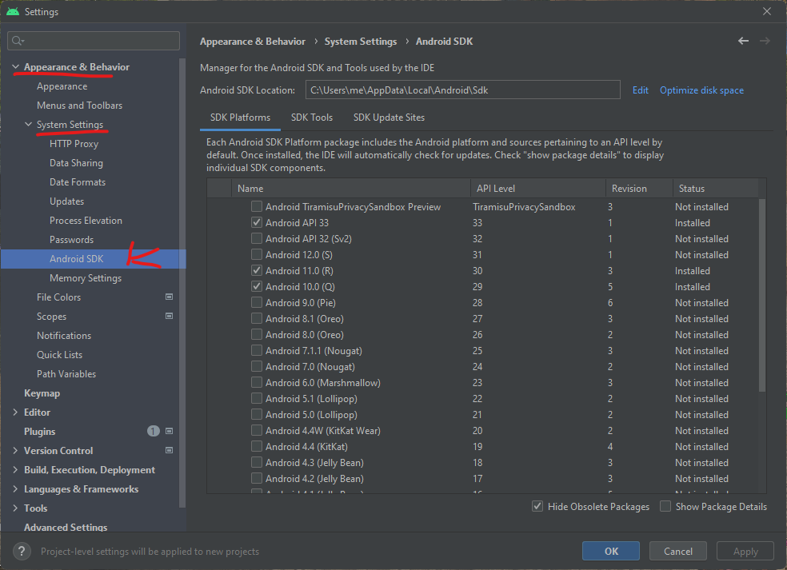

Now, make sure you are in the **SDK Platforms** tab and have **Show Package Details** checked:

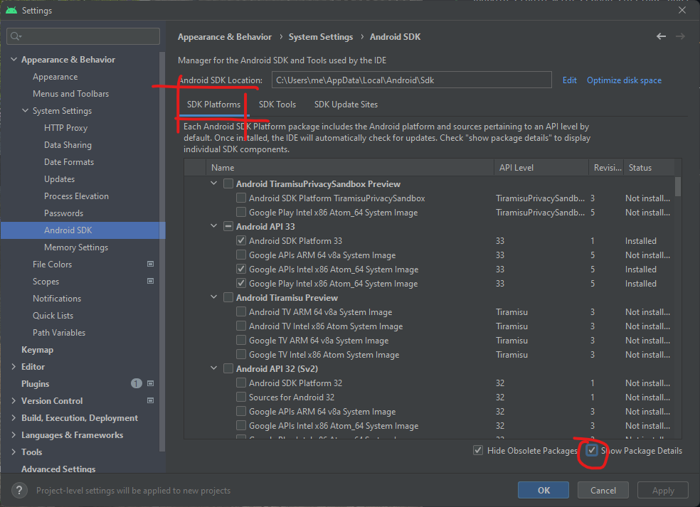

In here, select the SDK platform you are targetting.
Note that higher SDK versions are usually backwards compatible, but earlier versions are usually not upwards compatible.
It's good practice to target the highest available (stable / non-preview) version.  
**Make sure to check the `Android SDK Platform <Number>` and, if you want to run an emulator, any of the System images.**  
Commonly your host will run on x86_64, thus use an image fitting here.
There are also special images for "Google Play" and "Google APIs" which come preinstalled with Google apps.
You _may_ need this if your final app is using any of these service, otherwise the normal image suffices.  
**Furthermore, make sure to select an Android image, not an TV or Wear image.**  
For example:

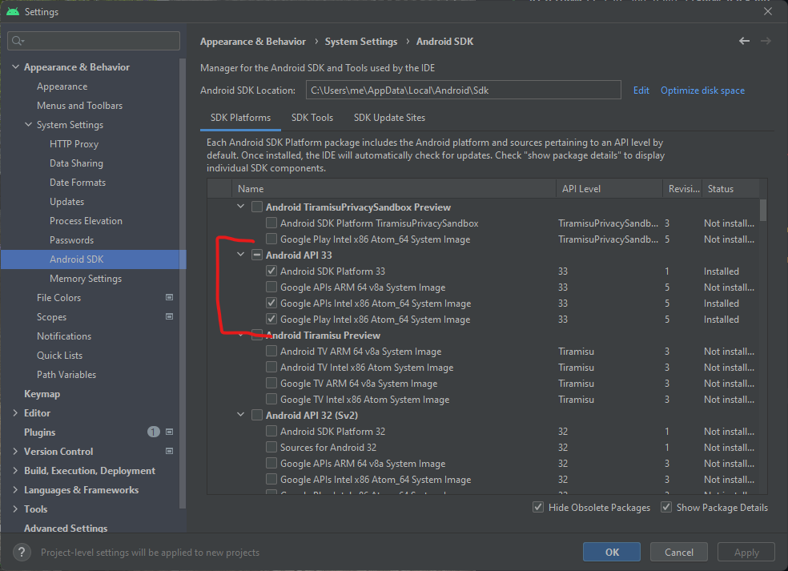

> Note that as of writing this Platform 33 is the latest stable version and I am on a x86_64 host. Depending on when this is read we may be on a higher stable version. **It is recommended to use the highest stable version.**

Next, head over to the **SDK Tools** Tab:

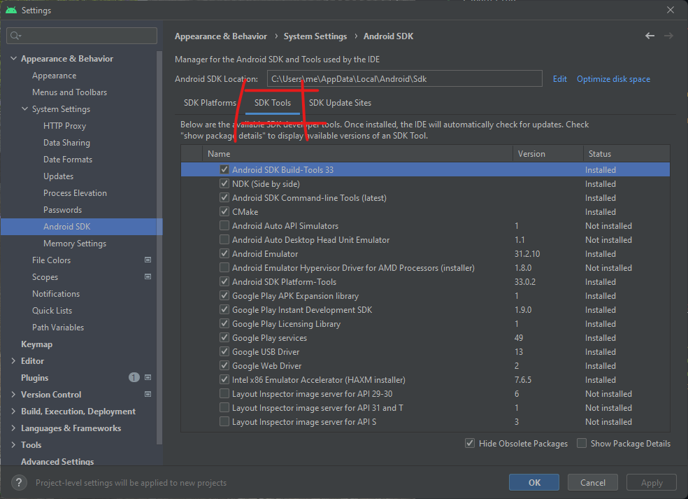

And select the following components:

- Android SDK Build-Tools
- NDK (Side by Side)
- Android SDK Command-line Tools
- Android SDK Platform-Tools

With optionally:

- Android Emulator (if you want to run an emulator)
- Any "Google *" package (if you are using their services)
- Intel x86 Emulator Accelerator [HAXM] (If you are on a supported Intel Platform) or Android Emulator Hypervisor Driver for AMD Processors (if you are on an AMD Platform)

> Note that you can check the `Show Package Details` option at the bottom right, which will give you different versions.
> However, using the latest version should be alright here and no special setup is (usually) needed.

For example:

> Red being mandatory/required; Blue is recommended but optional and everything unchecked is optional and probably not needed.

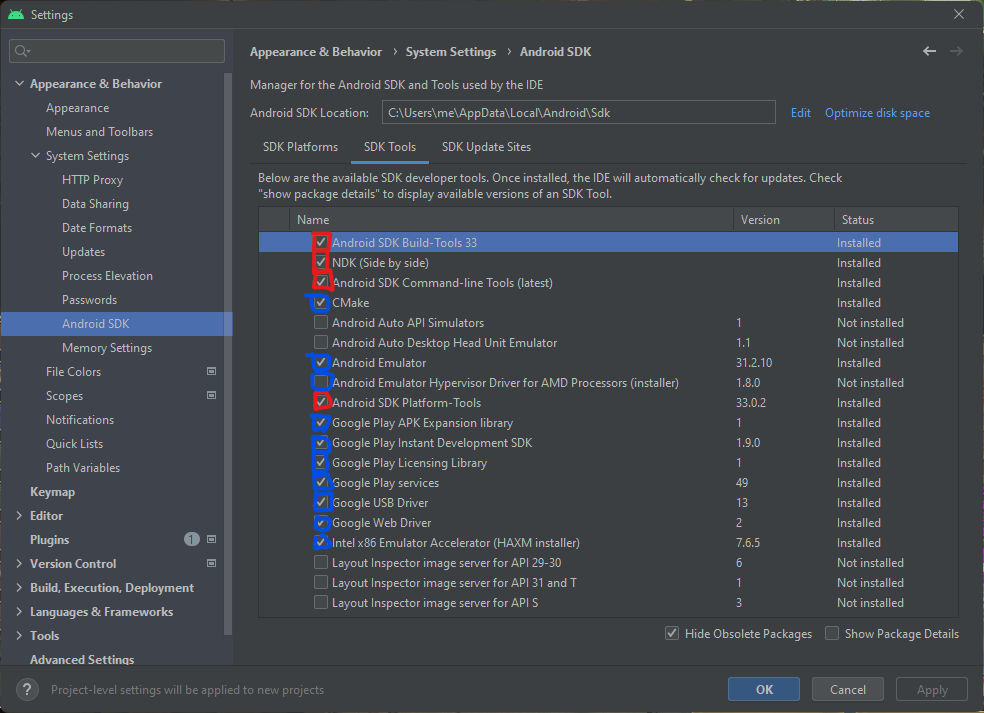

Finally click on Ok.  
Android Studio will start downloading your packages and _may_ ask for licenses again.
Accept them and close the dialogues once done.

That's it! You are now set and have the Android SDK installed!  
In case `cargo-apk` keeps complaining about the `ANDROID_SDK_HOME` or `ANDROID_NDK_HOME` not being set, please refer to the ["Both"](#both) part.

Now open this project (either clone it first or use Android Studio's VCS feature).
You should see a message in the corner that the Rust and WebAssembly plugins are missing:

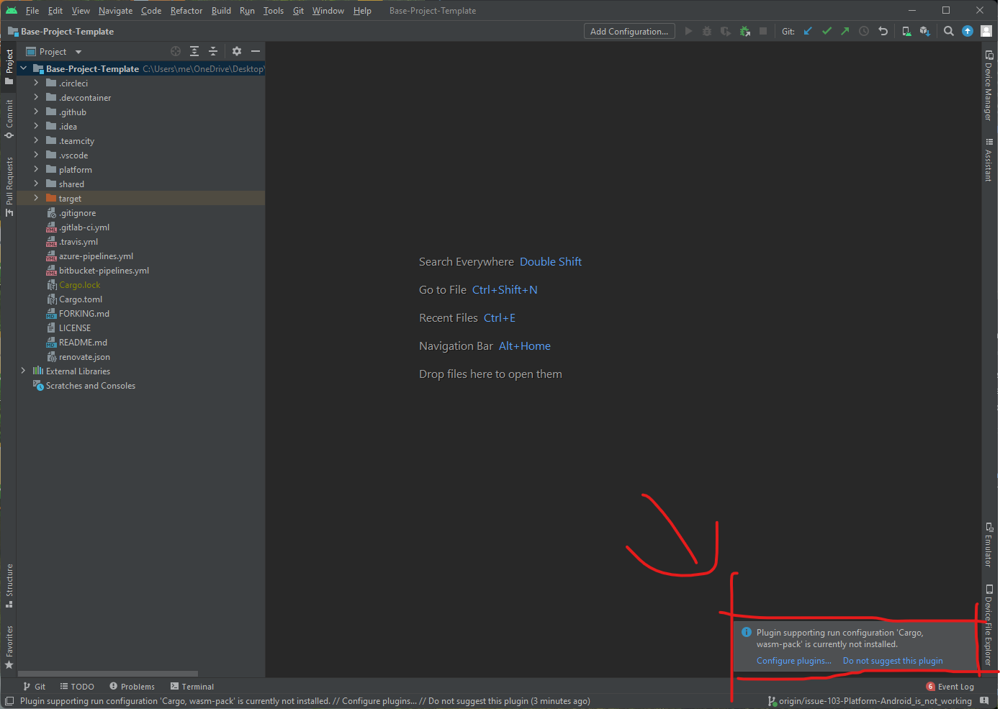

Click on **Configure plugins ...**, install them and possibly restart Android Studio.

This is it mostly. Android Studio should be able to detect the Rust tasks now.
In the upper right corner you will find all the tasks, including building and running for Android:

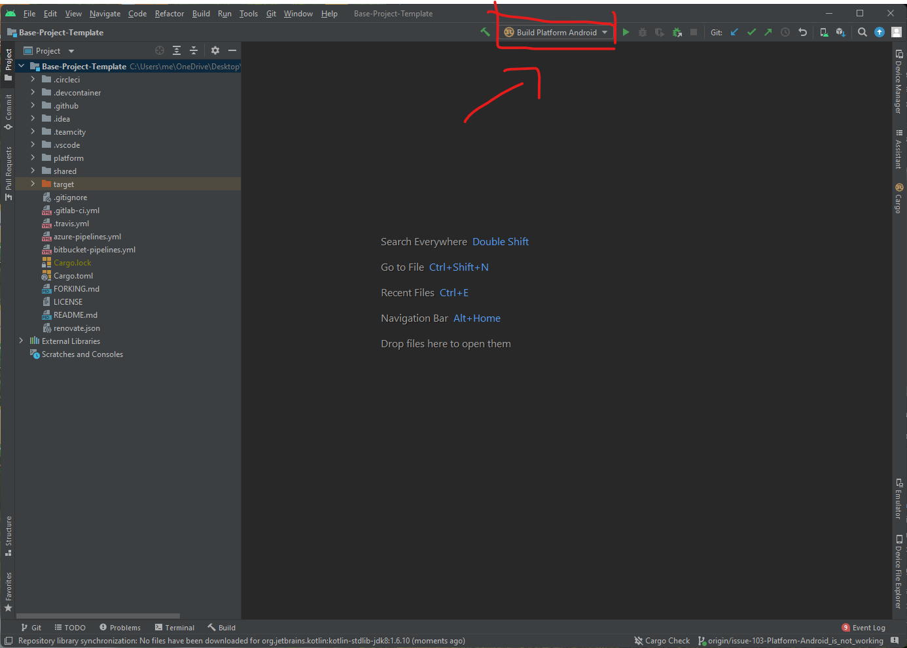

Left from it you will find a build icon. This does only somewhat work! Rather select the `Build Android` task and click on the Run/Play icon to the right of the task selection.

Running the app inside Android Studio is as simple as using the `Run Android` task.  
However, this does not attach tasks or a debugger.  
You can either utilize the terminal tab in the bottom bar and use `cargo apk gdb` to attach a debugger or `adb logcat RustStdoutStderr:D *:S` to attach logs, or do the following:

First build the App with the `Build Android` task.  
Then, click in the top left bar on File -> Profile or Debug APK:

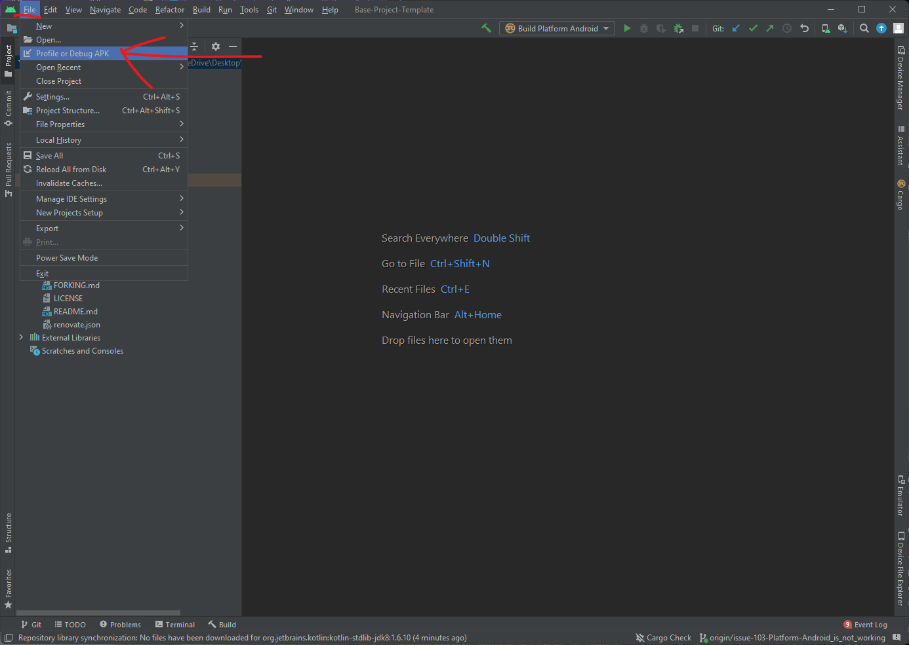

Now navigate to `target/debug/apk/` and select your APK.  
There may be two, choose the normal one without `*-unaligned.apk`.  
Ideally, open the project in a new Window.

Android Studio now shows you the APK and gives you the option to run and debug it.  
Each time the app is changed and build, this project needs to refresh though.

**Unfortunately, there is currently no other way in Android Studio to effectively attach logs and/or a debugger.**

This covers everything, except for Emulators.  
You can use your Android phone in **USB-Debugging mode** or setup an Emulator.  
To create an Emulator click on the `Device Manager` tab to the right:

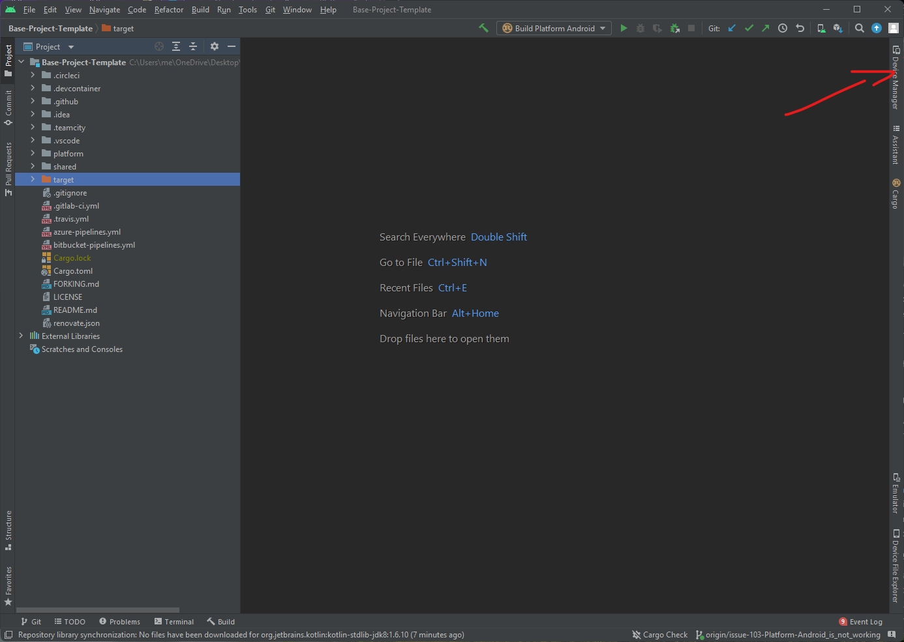

Now click on `Create`:

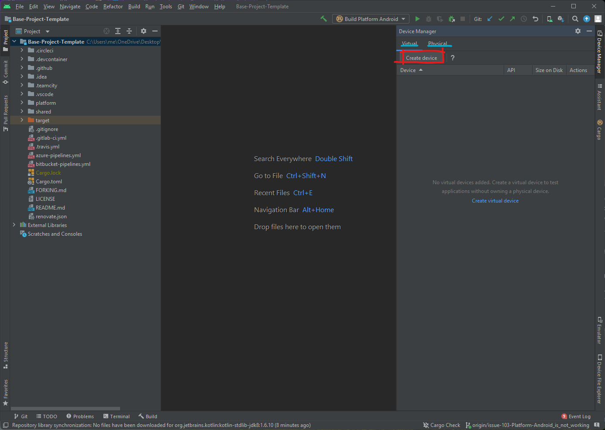

> Note that there are two tabs [marked in blue]: One for Virtual Devices (Emulators) and one for Physical Devices (your phone).

Select any device from the list, but make sure you have the category **Phone** selected:

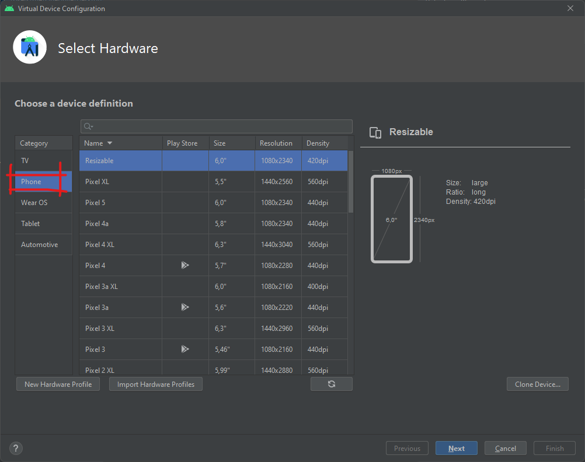

> Note that the Play Store isn't supported on all device types. If you need it chose a device that supports it.

Now select the system image you want to use.  
Be cautious of the tabs (marked in blue) as `Recommended` only shows a select few images:

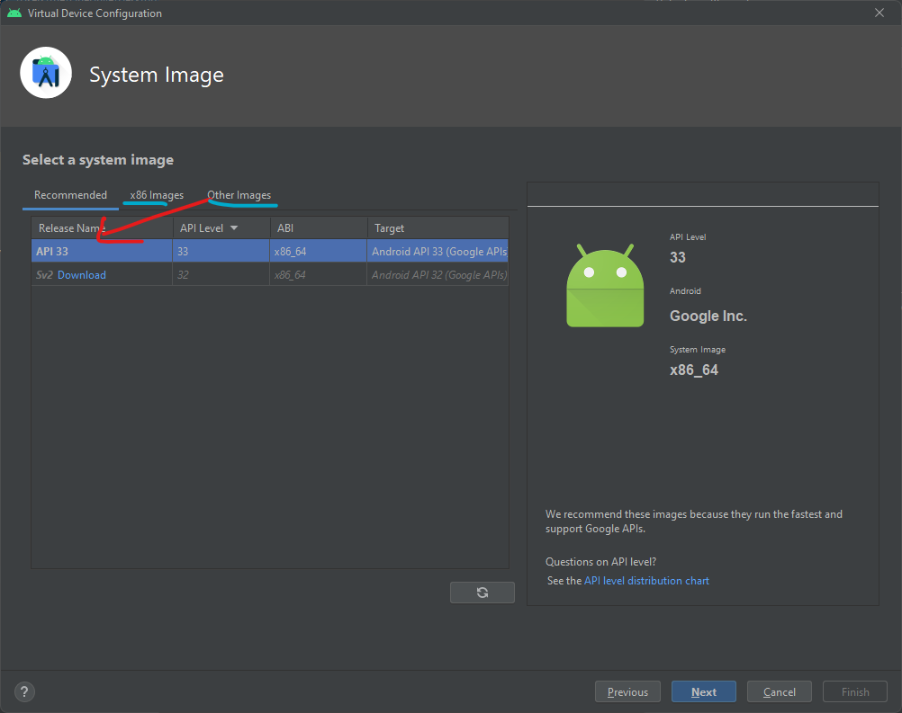

> If it says `Download` next to an image you can click it to download said image. You should have done so beforehand though, make sure you are selecting the correct image.

Finally, give your AVD a name.
You can ignore most of the other settings though there is an `Advanced Settings` button at the bottom.  
**However, if you are intending to run any kind of graphical application, e.g. with rendering to the screen, you do want to change the graphics to _Hardware_.**

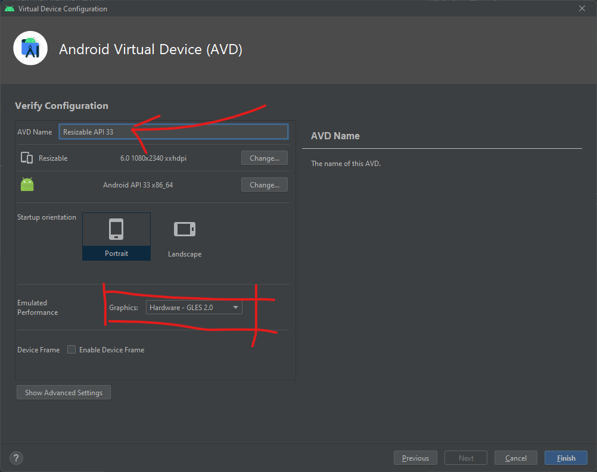

Finally, you should see your AVD in the Device Manager:

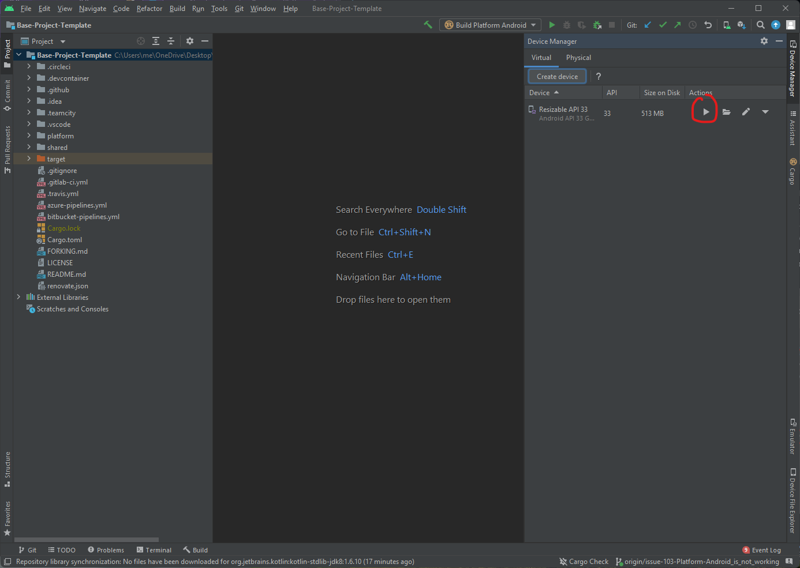

Clicking on the run/play button (marked) the AVD will launch inside Android Studio and `cargo-apk` (or more like `adb`) should be able to talk to it.

### Android CommandLine-Tools

First, download the [Android CommandLine-Tools](https://developer.android.com/studio/#command-tools) and extract it.  
Commonly, the Android SDK is installed at `/opt/Android` on Linux, `/Library/Android` on macOS and `%APPDATA%/Android` on Windows.
However, you can place this where ever you want.

Next, add the following locations to your `PATH` environment variable:

- `cmdline-tools/latest/bin/`
- `build-tools/<version>/`
- `platform-tools/`
- `ndk/<version>/`
- `emulator/` (Only if you need an emulator and it will be installed)

You will find those inside the extracted archive and thus your installation location.  
**Note that some of these folders may be missing. You can create them yourself or run the commands below first and come back to this step.**

Afterwards we have to add two more environment variables:  
First, set `ANDROID_SDK_ROOT` (**NOT** `ANDROID_SDK_HOME`) to the extracted location.  
Next, set `ANDROID_NDK_ROOT` (**NOT** `ANDROID_NDK_HOME`)  to the `ndk/<version>/`. Make sure to not set `ndk/` itself and keep in mind to update this in case there is an NDK update.

Now open a terminal, console or command-line (you may need to logout and login again) and see if `sdkmanager` is available.  
If it isn't, recheck your configuration.

Use `sdkmanager --list` to get a list of all the available packages.
Be aware that this is printing out every version available.
Try CTRL+F in your terminal to search for things or use something like `sdkmanager --list | grep 'your_query'`.

Generally, we want the following packages installed:  

- `platforms;android-<version>` # Android SDK
- `platform-tools` # Platform tools (adb and such)
- `ndk;<version>` # NDK
- `build-tools;<version>` # Build tools (android compilers, apk tools, etc.)
- `emulator` # (Optional)
- `system-images;android-<version>;google_apis;<arch>` # (Optional) Emulator Image; `google_apis` is optional and indicated that the image should have Google's APIs installed. Same thing is true for `google_play`.

> Note that you need to query for the latest versions manually with the list command from above.  

You can change the commands together like this:

```shell
sdkmanager 'platforms;android-<version>' 'system-images;android-<version>;google_apis;x86_64' 'platform-tools' 'emulator' 'ndk;<version>' 'build-tools;<version>'
```

That's it. `cargo-apk` should be happy now!  

However, we may also need an Emulator.  
**This step is optional, you can also use your Android phone in USB-Debugging mode.**

To create an AVD (Android Virtual Device) we simply use `avdmanager` together with a name and an image.  
Check out `avdmanger --help` for more options on how to customize the AVD or reply with 'yes' if asked for a `custom hardware profile`.
Otherwise, the defaults will be used for that platform.

```shell
avdmanager create avd -n <name> -k <system image string from above; the 'system-images;android-<version>;google_apis;<arch>'>
```

To launch the AVD simply use `emulator`:

```shell
emulator -avd <name from previous step>
```

Closing can be done by simply pressing CTRL+C in your terminal.

Attaching to logs is done via:

```shell
adb logcat RustStdoutStderr:D *:S
```

> Note: Run this in a separate terminal from your Emulator.

### Both

This variant is in case you decide to want both variants (e.g. VSCode for coding but Android Studio for Debugging).  
We highly recommend **NOT** installing the command-line tools beforehand, but download and install Android Studio and follow the setup of it as described above.

Next, head to the command-line tools section and add the paths to your `PATH` environment variable.
Additionally, make sure that `ANDROID_SDK_ROOT` and `ANDROID_NDK_ROOT` are set correctly as described in the command-line tools section.

You can find the SDK location that Android Studio setup and is using by going into the SDK settings again:

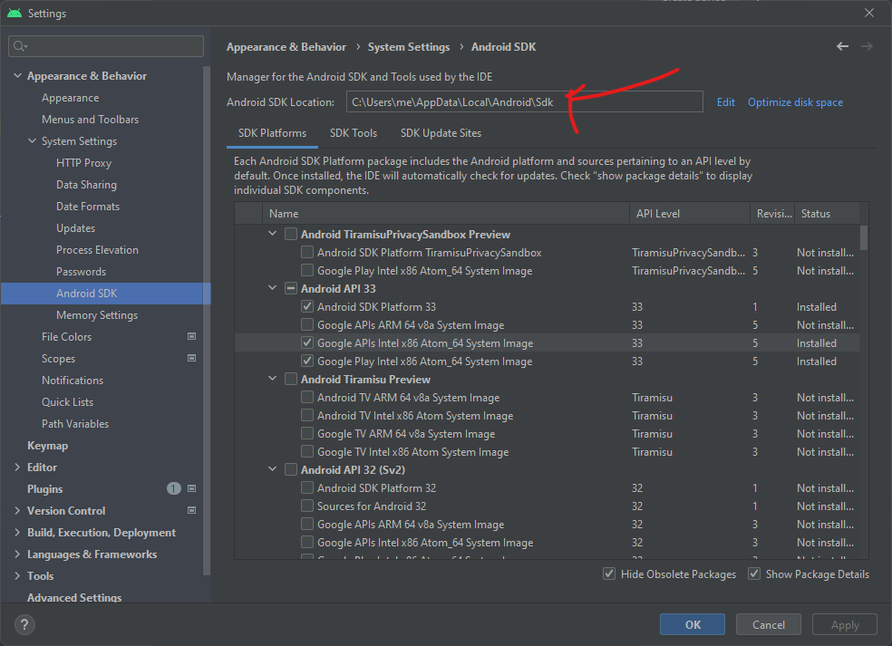

This method is the best of both paths.  
It enables you to use the command-line tools in e.g. VSCode while debugging is possible in Android Studio.

**Furthermore, in case `cargo-apk` has trouble finding the Android SDK/Tools after only installing Android Studio: This should fix it.**

## Rust Setup

To build an Android compatible binary/library from Rust, we need to install the Android-targets for Rust first.

Using [RustUp.rs](https://rustup.rs) we can simply and quickly add target architectures to our toolchain:

```bash
rustup target add aarch64-linux-android 
rustup target add arm-linux-androideabi 
rustup target add armv7-linux-androideabi 
rustup target add i686-linux-android 
rustup target add thumbv7neon-linux-androideabi 
rustup target add x86_64-linux-android 
```

> Note: Depending on what Android Architecture you are targeting, you only need to install the required targets.

There is no direct correlation to Android versions here.  
**However, the `ndk-glue` crate is very dependent on various Rust and Android-NDK versions.**
Check their [matrix here](https://github.com/rust-windowing/android-ndk-rs/blob/master/README.md#supported-ndk-versions) to learn more.

## Building

|                         | Host: Windows                                                                                                                                                                                                                                                    | Host: Linux                                                                                                                                                                     | Host: macOS                                                                                                                                    |
| ----------------------- | ---------------------------------------------------------------------------------------------------------------------------------------------------------------------------------------------------------------------------------------------------------------- | ------------------------------------------------------------------------------------------------------------------------------------------------------------------------------- | ---------------------------------------------------------------------------------------------------------------------------------------------- |
| **Target: Windows**     | ✅: [Visual Studio](https://visualstudio.com/)                                                                                                                                                                                                                    | 🔀: [MinGW](https://www.mingw-w64.org/)                                                                                                                                          | 🔀: [MinGW](https://www.mingw-w64.org/)                                                                                                         |
| **Target: Linux**       | ⚠️: [WSL](https://docs.microsoft.com/en-us/windows/wsl/) or VM or Docker                                                                                                                                                                                          | ✅: [GCC](https://gcc.gnu.org/) or [Clang](https://clang.llvm.org/)                                                                                                              | 🔀: Docker or VM                                                                                                                                |
| **Target: macOS**       | ⚠️: [Docker-OSX (inside WSL with Docker)](https://github.com/sickcodes/Docker-OSX) or [OSX-KVM (inside WSL or VM)](https://github.com/kholia/OSX-KVM) or [macOS-VirtualBox (inside/with WSL and/or MSYS2/MinGW)](https://github.com/myspaghetti/macos-virtualbox) | ⚠️: [Docker-OSX](https://github.com/sickcodes/Docker-OSX) or [OSX-KVM](https://github.com/kholia/OSX-KVM) or [macOS-VirtualBox](https://github.com/myspaghetti/macos-virtualbox) | ✅: [XCode](https://developer.apple.com/xcode/)                                                                                                 |
| **Target: Android**     | 🔀: [Android Studio](https://developer.android.com/studio/) or [Android CommandLine-Tools](https://developer.android.com/studio/#command-tools)                                                                                                                   | 🔀: [Android Studio](https://developer.android.com/studio/) or [Android CommandLine-Tools](https://developer.android.com/studio/#command-tools)                                  | 🔀: [Android Studio](https://developer.android.com/studio/) or [Android CommandLine-Tools](https://developer.android.com/studio/#command-tools) |
| **Target: iOS**         | ⚠️: [Docker-OSX (inside WSL with Docker)](https://github.com/sickcodes/Docker-OSX) or [OSX-KVM (inside WSL or VM)](https://github.com/kholia/OSX-KVM) or [macOS-VirtualBox (inside/with WSL and/or MSYS2/MinGW)](https://github.com/myspaghetti/macos-virtualbox) | ⚠️: [Docker-OSX](https://github.com/sickcodes/Docker-OSX) or [OSX-KVM](https://github.com/kholia/OSX-KVM) or [macOS-VirtualBox](https://github.com/myspaghetti/macos-virtualbox) | ✅: [XCode](https://developer.apple.com/xcode/)                                                                                                 |
| **Target: WebAssembly** | ✅: [Wasm-Pack](https://rustwasm.github.io/wasm-pack/installer/)                                                                                                                                                                                                  | ✅: [Wasm-Pack](https://rustwasm.github.io/wasm-pack/installer/)                                                                                                                 | ✅: [Wasm-Pack](https://rustwasm.github.io/wasm-pack/installer/)                                                                                |

✅ = Natively supported.  
🔀 = Cross-Compilation & Toolchain needed.  
⚠️ = Possible, but takes some more effort and/or special setups or VM to work.

Requirements:  

- Rust and Cargo is installed, preferably via [Rustup](https://rustup.rs/). Use the stable channel ideally.
- Android can **only** be cross-compiled, it works on Windows, Linux and macOS though:
  - Install [Android Studio](https://developer.android.com/studio/) or [Android CommandLine-Tools](https://developer.android.com/studio/#command-tools); Check out [Android Setup](#android-setup) for more information.
  - Install [Cargo-APK](https://crates.io/crates/cargo-apk): `cargo install cargo-apk`

Debug/Development Build:

```shell
cargo apk build --package platform_android
```

Release/Production Build:

```shell
cargo apk build --package platform_android --release
```

> Optionally add `--verbose` to see what is happening.  
> Floods your console with message though possibly, use when there are build errors.

Take a look into the `Cargo.toml` and see all the different fields.  
Android relies a lot on Meta-Data. Check [Android-NDK-rs/NDK-Glue](https://github.com/rust-windowing/android-ndk-rs) for more on those fields.

## Testing

Requirements:  

- Rust and Cargo is installed, preferably via [Rustup](https://rustup.rs/). Use the stable channel ideally.
- Android can **only** be cross-compiled, it works on Windows, Linux and macOS though:
  - Install [Android Studio](https://developer.android.com/studio/) or [Android CommandLine-Tools](https://developer.android.com/studio/#command-tools); Check out [Android Setup](#android-setup) for more information.
  - Install [Cargo-APK](https://crates.io/crates/cargo-apk): `cargo install cargo-apk`
  - Either an Android Device in Development-Mode connected via `adb` or an Android Emulator.

> Note: Testing on Android is possible but much more complex.  
> Your tests may work, but may also break.

Debug/Development Testing:

```shell
cargo apk test --package platform_android
```

Release/Production Testing:

```shell
cargo apk test --package platform_android --release
```

> Optionally add `--verbose` to see what is happening.  
> Floods your console with message though possibly, use when there are build errors.

## Running

Requirements:  

- Rust and Cargo is installed, preferably via [Rustup](https://rustup.rs/). Use the stable channel ideally.
- Android can **only** be cross-compiled, it works on Windows, Linux and macOS though:
  - Install [Android Studio](https://developer.android.com/studio/) or [Android CommandLine-Tools](https://developer.android.com/studio/#command-tools); Check out [Android Setup](#android-setup) for more information.
  - Install [Cargo-APK](https://crates.io/crates/cargo-apk): `cargo install cargo-apk`
  - Either an Android Device in Development-Mode connected via `adb` or an Android Emulator.

Debug/Development Running:

```shell
cargo apk run --package platform_android
```

Release/Production Running:

```shell
cargo apk run --package platform_android --release
```

> Optionally add `--verbose` to see what is happening.  
> Floods your console with message though possibly, use when there are build errors.

To retrieve logs you need to use:

```shell
adb logcat RustStdoutStderr:D *:S
```

> Note: to capture app crashes either _first_ launch this command in a shell _or_ relaunch the app after having adb up.
